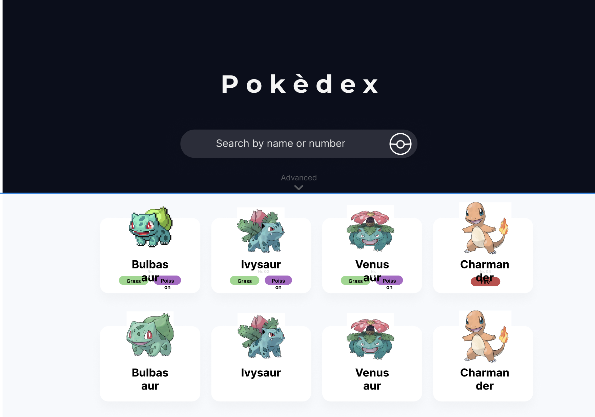
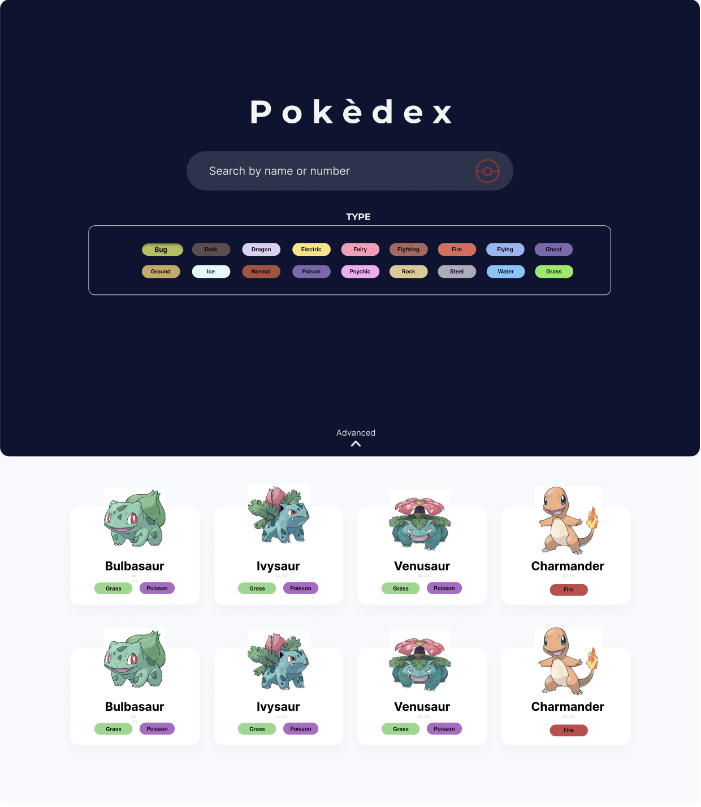
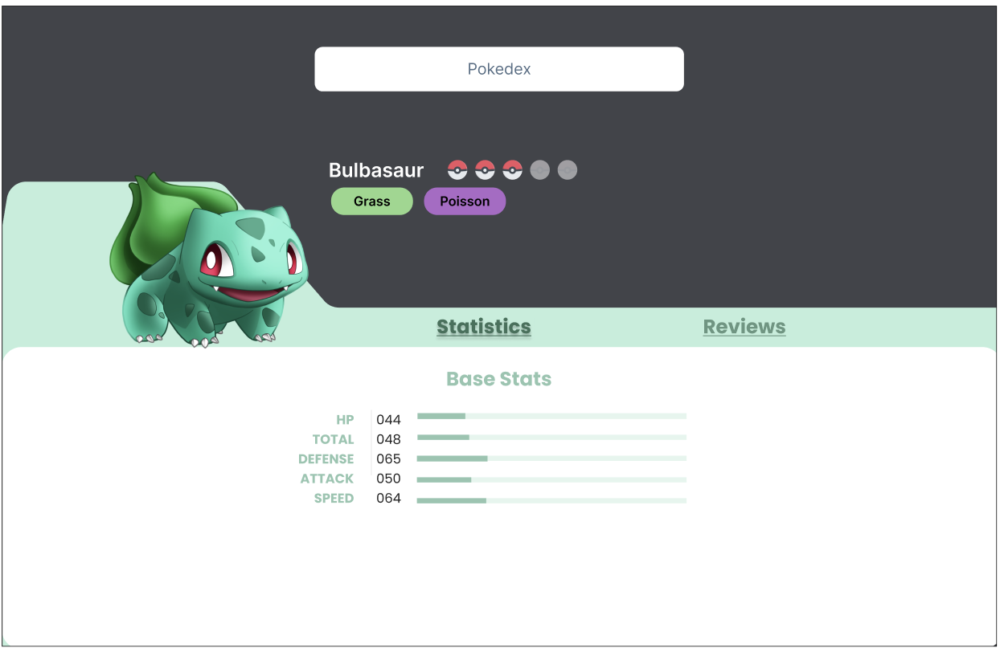
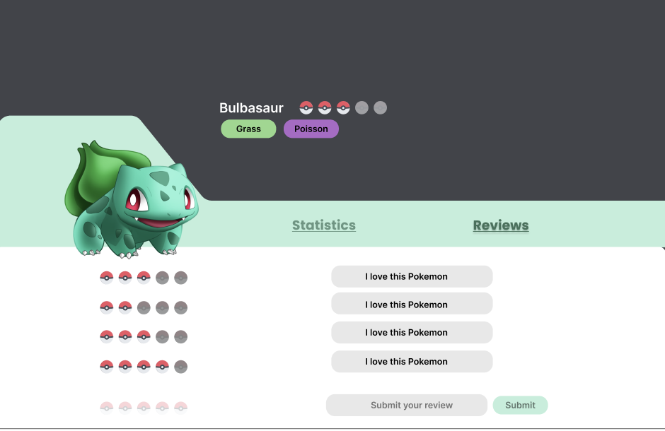
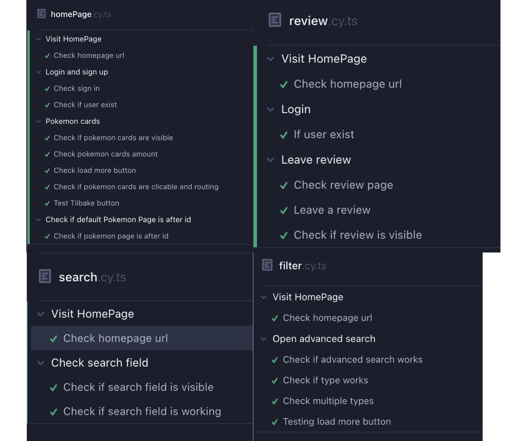

# Pokédex
## IT2810-prosjekt 3

# Dokumentasjon

## Beskrivelse av applikasjonen
Vi har laget en Pokédex, som er en applikasjon hvor man kan søke på og filtrere ulike pokemons. Her kan man altså søke på navnet til pokemons, samt filtrere på pokemon-type. Data som fremkommer av søket vil visualiseres som pokemon-cards, hvor det viser bilde av pokemon, navn og typen/e. Initielt vil man få opp 24 pokemons, men ved å trykke på “Load More”-knappen får man opp 24 til. Dersom man trykker på Pokemon-Card navigerer man til en detaljert side om valgt Pokemon. På denne siden ligger det blant annet mer informasjon om Pokemonen sine attributter samt brukergenererte reviews ved å lage en bruker og være logget inn. Vi har implementert persistent brukergenerert data ved reviews funksjonaliteten. 

## Styling
Vi valgte bruke Tailwind CSS (https://tailwindcss.com/) for styling av komponentene i dette prosjektet også, ettersom at gruppen var svært fornøyde med dette etter prosjekt 2. Hvorav årsaken var at det muliggjør å enkelt style komponenter inline, som gir en mer oversiktlig arbeidsprosess. Vi valgte også å bruke figma for å visualisere stylingen før vi begynte å kode. 



<br>


<br>

## Oppsett av prosjektet
Hvordan kjøre prosjektet lokalt, frontend og backend

1. Klon repoet fra GitLab med SSH/HTTP i ønsket plassering
2. Gå inn i mappen `prosjekt-3/api` i terminalen
3. Opprett en fil, som du kaller `.env`
4. Legg til innholdet under i `.env`-filen
```
NEO4J_URI=bolt://localhost:7687
NEO4J_USER=neo4j
NEO4J_PASSWORD=webgruppe1

NEO4J_DATABASE=neo4j

GRAPHQL_SERVER_HOST=https://it2810-28.idi.ntnu.no
GRAPHQL_SERVER_PORT=4001
GRAPHQL_SERVER_PATH=/graphql

GRAPHQL_LISTEN_PORT=4001
GRAPHQL_URI=http://localhost:4001/graphql

JWT_SECRET=secret
```
5. I terminalen kjør `npm run start:dev`i api-mappen, da har du startet databasen
6. Naviger deg til `prosjekt-3/src/cache.ts` og endre adressen til `http://localhost:4001/graphql`
7. Naviger så til `prosjekt-3`-mappen,kjør `npm install` og “npm start”  for å starte frontenden av prosjektet. 

## Testing

### Systematisk enhetstesting
Vi brukte Jest til systematisk enhetstesting. Jest er et Javascript test rammeverk, som også kan brukes til å teste typescript komponenter. Når vi skulle ta i bruk snapshot valgte vi gjøre det ved å teste blant annet Header og Footer komponentene. Optimalt skulle vi gjerne testet større deler av prosjektet, men grunnet begrenset tid måtte gruppen prioritere ressursene andre steder. 

### Automatisk ende-til-ende testing
Til automatisk ende-til-ende testing har vi tatt i bruk testverktøyet Cypress. Fremfor å teste hvert eneste komponent og element ved å trykke på knapper, inspisere i inspect-vinduet og undersøke i console og visuelt, har vi brukt Cypress som automatiserer samt effektiviserer denne prosessen. Dette økte både kvaliteten på ende-til-ende testingen og gjorde utviklingen raskere. I tillegg til at Cypress bruker en ekte browser (vi har konfigurert i Google Chrome) til å kjøre testene som gir oss resultater som er nærmest identiske til ekte brukeropplevelser og visualiserer når testene kjøres. Cypress er lettlest og enkelt å forstå som er en fordel av verktøyet. 

Ettersom det var tidkrevende å teste ut absolutt alle edge caser, valgte vi noen spesifikke tilfeller som vi mente var mest sannsynlig tilsvarende en ekte case og representerte vår nettside. Dette vil si at vi testet komponentene og deres funksjonalitet fra ende til ende. Altså en typisk “brukerflyt” gjennom applikasjonen, og når komponenter vises og ikke, om Pokemonkortene vises riktig etter søk eller filtrering etter type. 
Testene befinner seg i cypress/e2e.

For å kjøre testene kan man skrive ´npx cypress open´ for å få visuelle bilde



## Backend
Vi valgte å bruke Neo4j som database. Neo4j er en graf-database som representerer relasjoner. Ettersom det var et teknisk krav om en GraphQL backend var også Neo4j er godt valg, siden bruk av GraphQL med en Neo4j database kommer med flere fordeler. Databasen ble installert på en virtuell maskin (NTNU server), hvor vi la inn alle pokemonene og tilhørende data. Vi utnyttet at Neo4j er en graf-database ved å legge inn f.eks. ratings som en relasjon til pokemons, slik at man slapp å iterere over alle pokemons for å matche indeks. 

## State management
Applikasjonen utnytter Apolliklienten for å håndtere global variabler. Dette var et naturlig valg ettersom at vi allerede bruker Apollo i forbindelse med håndtering av data fra databasen.Innloggingsstatusen til brukeren lagres i reaktive variabler utenfor bufferen til Apollo-Clienten, og kan nås i alle komponentene i appolikasjonen. 

Ved å bruke apollo client kunne vi lagre en global state som var tilgjengelig for alle komponentene. Vi valgte å benytte state management for å kontrollere en brukers tilstand (logget inn/ ikke logget inn). Om en bruker ikke er innlogget vil de ikke ha muligheten til å kunne skrive reviews på pokemons.

## Søk og Filtrering
Siden implementerer muligheten for å søke på navn og filtrere på type. En nedtrekksmeny viser de ulike typene som det er mulig å filtrere på. Om man trykker på disse type-knappene vil man aktivere typen, og man vil deretter kun søke på pokemons som har denne typen. Søkene viser et begrenset antall pokemons, men brukeren kan trykke på en “load more” knapp på bunnen for å laste flere pokemoner. Dette er implementert for å ikke laste unødvendig mye data fra databasen. Begrensningen er implementert med offset og limit, og ved klikk på knappen hentes mer data ved bruk av FetchMore-funksjonen fra Apollo-Client.

```
query Pokemon($offset: Int = 0) {
 pokemon(
 options: {
   limit: 24,
   skip: $offset
 }) {
    pokemonID
     name
     height
     weight
     speed
     sp_attack
     sp_defence
     attack
     defence
     type1
     type2
     hp
     imageUrl
 }
}
```

## Teknologi

### Mui components
For visse komponenter valgte vi bruke Material UI, eller mui, components for å enkelt implementere ferdig stylede komponenter. Mui er et bibliotek av ferdiglagde React-komponenter, som gjør at vi kan lage nye komponenter svært raskt. Eksempelvis bruker vi mui komponenter på “Comments” og “Rating”.

## Web accessibility
Web accessibility går ut på å tilpasse nettsider til å være tilgjengelig for alle, selv om man har ulike handikap som eksempelvis syns- eller hørselsskade. Dette tilsier at man må tilrettelegge nettsiden sin for at alle skal kunne forstå, navigere og interagere med nettet. Web accessibility består av fire prinsipper som må følges, de er følgende:

Perceivable

Informasjon of elementer i et brukergrensesnitt må bli presentert på en måte slik at de kan bli oppfattet av sansene, og slik at ingenting er udetektert eller usynlig. For flesteparten av mennesker vil dette kun gjelde visuelt, men for noen brukes gjerne lyd også. 

For å gjøre nettsiden vår “perceivable” har vi passet på å ha god kontrast mellom element og bakgrunn, ved bruk av farger. Element skilles også fra hverandre ved bruk av distanse mellom de. Skrift som er titler er forstørret og uthevet. På bilder har vi lagt inn alternativ tekst som forklarer at det er bilde av en pokemon, ved bruk av alt attributtet.

Operable

Interaktive element slik som knapper, navigasjon osv. bør være operable. Dette vil si at en bruker må kunne gjenkjenne elementet, og deretter kunne utføre nødvendig operasjon for å interagere med elementet, eksempelvis trykke på en knapp eller scrolle i en liste. For mennesker som ikke kan interagere på følgende måte brukes gjerne stemme-kommandoer eller eye-trackers.

For å implementere dette i vår hjemmeside har vi blant annet tatt hensyn til at i søkefeltet skal man kunne trykke enter, og ikke måtte trykke på søke-knappen, for at søket skal bli satt igang. 

Understandable

Teknologien skal være konsistent og klar i presentasjonen av formatet, med gjenkjennbare mønster av bruk og design. En bruker skal ikke ha problemer med å forstå meningen med informasjonen den har fått presentert.

For at det skal være intuitivt at man kan trykke på pokemon-cards har vi implementert en mørkere farge på kortet når man hoverer over. Dette gjorde vi for å øke kontrasten med bakgrunnen slik at brukere med nedsatt syn også skjønner at man kan trykke på kortet. En lysere hoverer farge har vi også på alle knappene våre for å øke brukervennligheten. Vi har også implementert en tilbakeknapp med navn “Back to Search page” på pokemon-siden slik at man enkelt kan skjønne at man kan gå tilbake til søkesiden.  

Robust

Robusthet er muligheten for at innhold skal fungere pålitelig på en variasjon av teknologier. Vi har testet robustheten til nettsiden vår ved å teste den i ulike browsere (Google Chrome og Firefox). Ettersom at nettsiden fungerte likt i de ulike nettleserne, kan vi erklære nettsiden robust.

## Bærekraftig Web Design
Internettet står i dag for 3,8% av det globalt karbonutslippet, og derfor har utviklere et ansvar for å sørge for at web-siden deres er mest mulig bærekraftig. For å sørge for en bærekraftig nettside har vi tatt hensyn til flere ting underveis i prosessen. For det første har vi jobbet kontinuerlig med å skrive mest mulig gjenbrukbar kode. Dette var enkelt å gjennomføre med tanke på at vi bruker React, som er kjent for å brukes til skriving av gjenbrukbar kode. 

Underveis i utviklingsprosessen har vi også brukt smidige metoder for å sikre effektivt arbeid. Bruk av smidige metoder er bevist at fører til bedre kodekvalitet, og dermed et mer bærekraftig web design.

Vi har også innført pagination slik at man ikke skal hente ut unødvendige mengder med data fra databasen, som sparer hele programvaren for energi. 

## Arkitektur
Gruppen ønsket å ha fokus på god og oversiktlig struktur for prosjektet. Dette bidro til effektivitet i utvikling og fokus på kvalitet. Diagrammet under viser det viktigste i vår mappestruktur.

```
📁api
📁public
📁src
├── 📁api
│ ├── 📁utils
├── 📁app
├── 📁common
│ ├── 📁components
│ ├── 📁hooks
├── 📁context
├── 📁pages
├── 📁public
│ ├── 📁assets
├── 📁styles
├── 📁types
├── 📁utils
```
